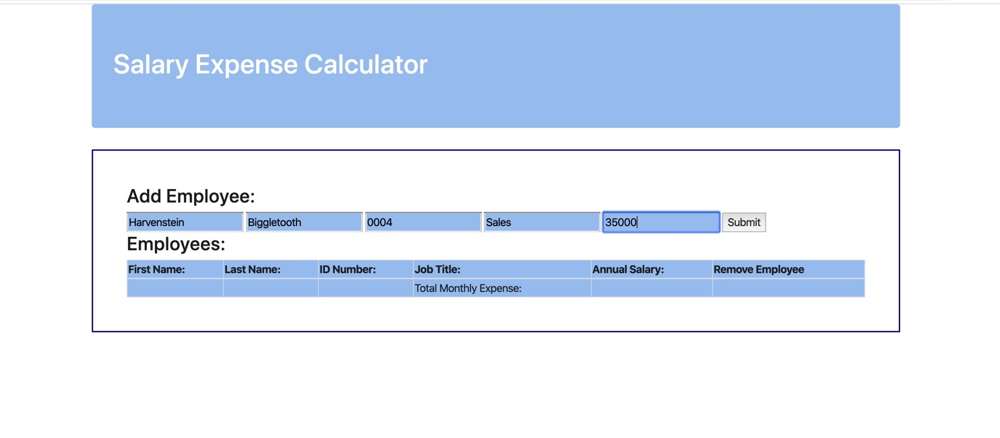
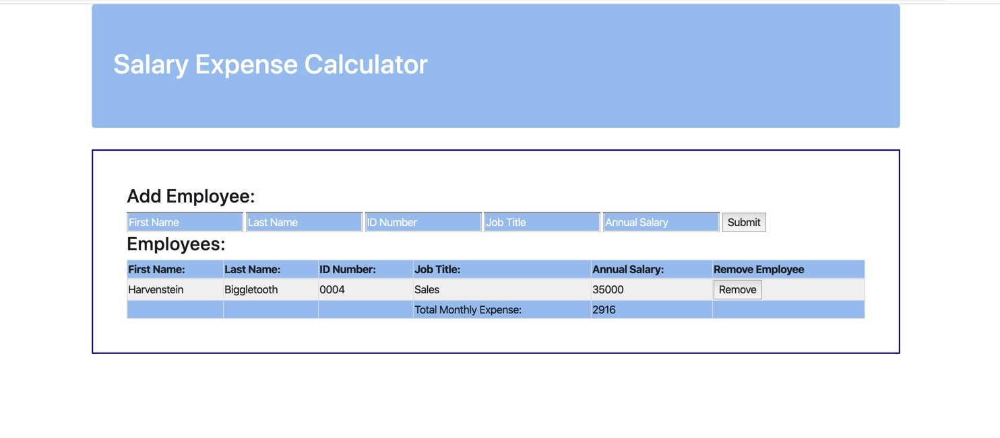
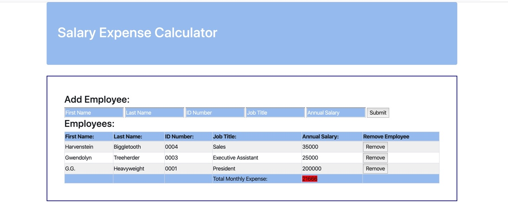

# Project Name
Alan's Awesome Salary Calculator

## Description
This application allows a user to enter employees annual salaries and gives a strong visual cue if the current compensation level will excced the pre-determined monthly budget.

User inputs as much of the employees' identifying information as desired along with salary.
This information is placed in an array and seperately into a table on the DOM.

The entered information is displayed on the page along with the total monthly expense of all entered employees. Individual lines can be removed as desired through the use of buttons on the DOM.

If the amount budgeted is excceded a red indicator appears around the total to alert the user of the problem.

